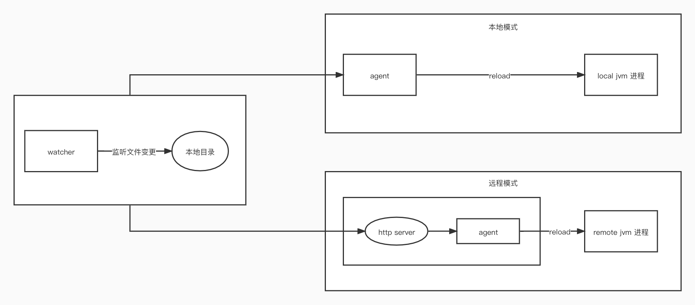

# java-hot-reload-agent

java 热更新插件，无需重启 java 进程实现代码更新，提高开发效率，节约时间去陪女朋友！

## 功能模块

- hot-reload-core: 核心处理逻辑，编译&加载 class 
- hot-reload-agent: javaagent 入口
- hot-reload-watcher: 监听本地 java 和 class 文件变化，实现本地进程热更新
- hot-reload-server: api server，提供接口实现加载远程 jvm 进程

## 架构




## 安装&使用

### 下载&安装（也可以用自行编译）
```bash
version="beta-1.0.0"
# 从 github 下载
wget https://github.com/fengjx/java-hot-reload-agent/releases/download/hot-reload-agent-all-${version}/hot-reload-agent-bin.zip
# 解压都任意目录
unzip hot-reload-agent-bin.zip -d hot-reload-agent
```

### 本地模式
```bash
# 启动
cd hot-reload-agent
sh boot.sh watcher $pid $path1,$path2
```
- pid: java 进程 id
- path: 监听的文件根目录，支持监听 `.class` 和 `.java` 文件，多个目录用`,`分隔


### server 模式

开发中

## 编译打包

环境依赖

- jdk 1.8+
- maven

```bash
# mac or linux
make package
```

```bash
# windows
mvn --settings=${maven_settings} clean package -Dmaven.test.skip=true -P full
```

打包完成后的文件保存在 `packaging/target/hot-reload-agent-bin.zip`，可以移动到任意目录，解压即可

## 测试覆盖情况

| 操作系统      | jdk 版本 | 说明 |
| ----------- | ----------- |------|
| MacOS 12.0.1       | openjdk 1.8       | - |

精力有限，其他未覆盖平台自行测试，如果你已测试过，欢迎联系补充

## 基本原理

1. watcher 监听本地文件变更（.class & .java）并缓存变更文件路径
2. 将变更文件上传到 server 并保存在临时目录（本地模式忽略次步骤）
3. 通过 javaagent 技术 attach 到 jvm 进程，拿到`Instrumentation`对象
4. 使用自定义类加载器（与业务代码隔离）加载 `hot-reload-core` 编译 java 文件（如有）
5. 读取 class 文件字节码，通过`instrumentation.redefineClasses()`方法重新定义并加载 class jvm

## todo list

<https://github.com/fengjx/java-hot-reload-agent/issues?q=is%3Aopen+is%3Aissue>

## 参考项目

- [arthas](https://github.com/alibaba/arthas)
- [lets-hotfix](https://github.com/liuzhengyang/lets-hotfix)
- [HotswapAgent](https://github.com/HotswapProjects/HotswapAgent)

